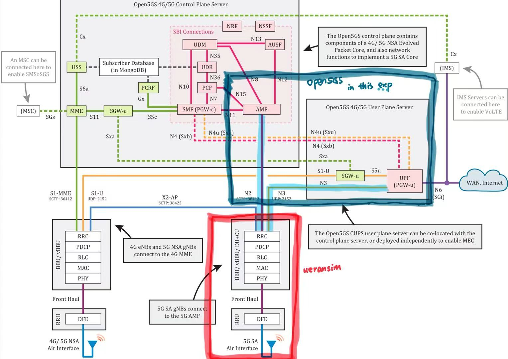
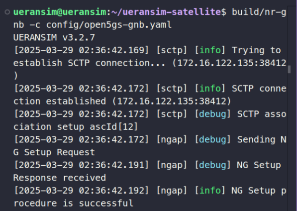
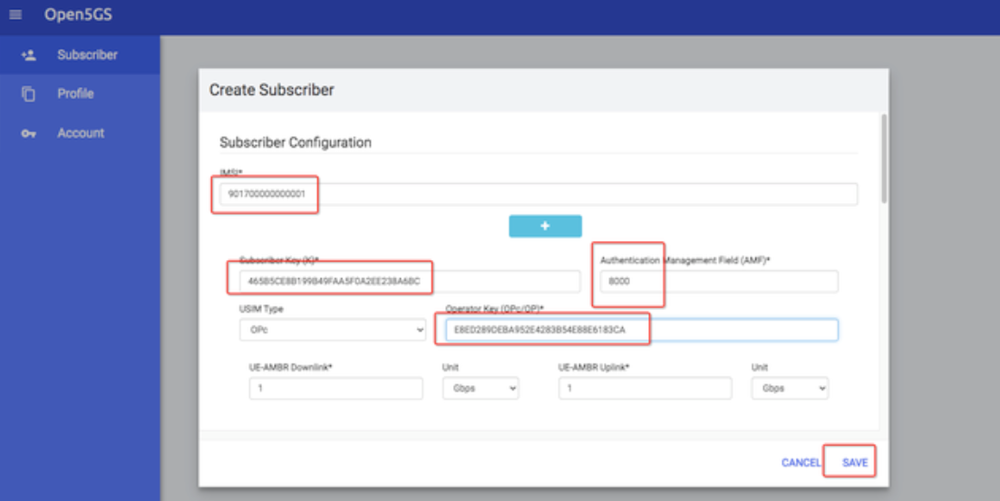
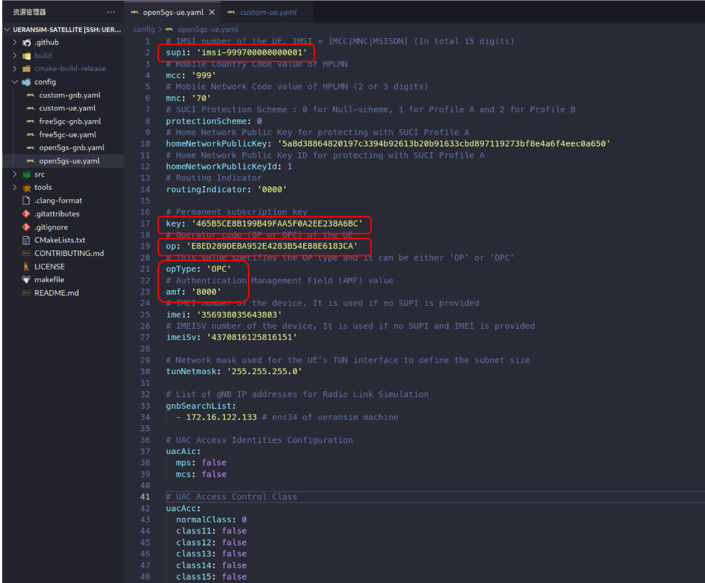
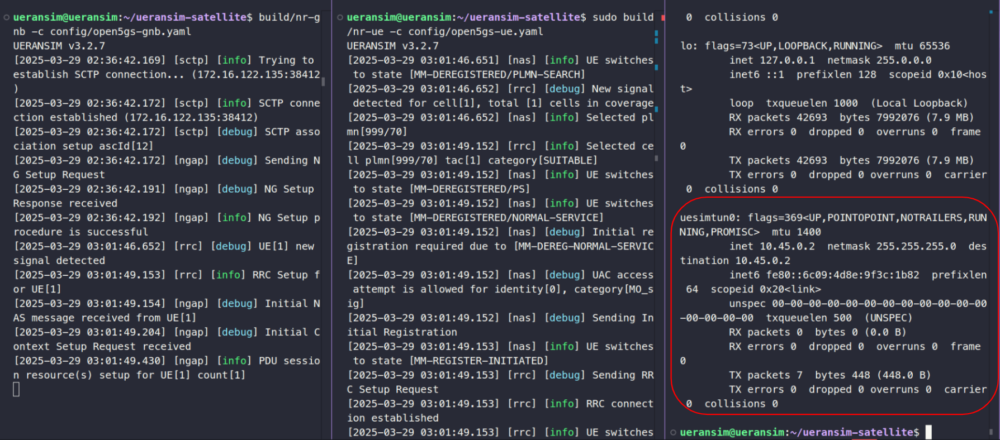
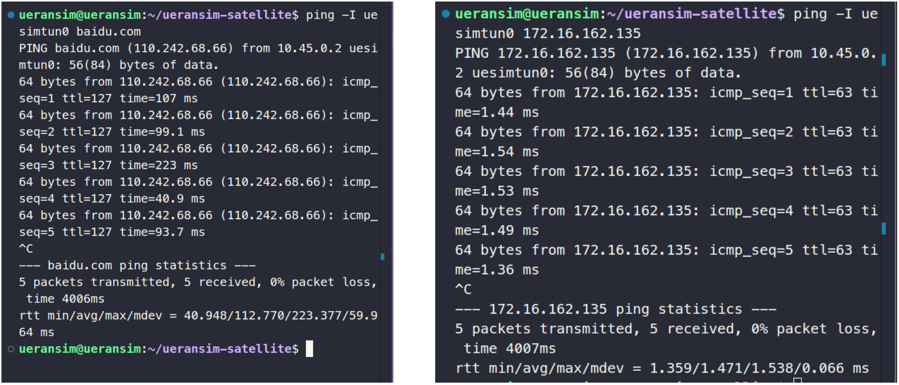
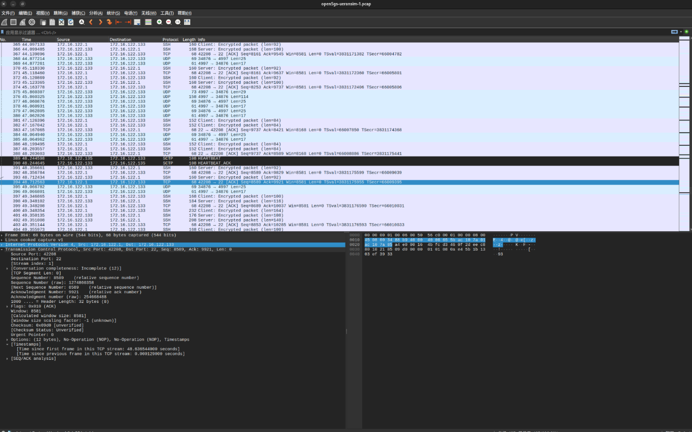

# End2End TrafficGen Instances (Terrestrial)

> Conducting End-to-End Terrestrial Traffic Generation Testing Based on OpenSat

For a user equipment (UE) in a 5G core network, we aim to traverse the core network and reach a server in the wide-area network (WAN) to establish a connection and conduct traffic testing.

In this process:

1. Network traffic can be captured and analyzed using **Wireshark** or **Traceroute** to determine the traffic path.  
2. The 5G core network is implemented using **Open5GS**.  
3. The UE can be either an **Open5GS-native component** or simulated using **UERANSIM**.

## Environments and Devices

**Coding Repo**

- [open5gs-satellite](https://github.com/root-hbx/open5gs-satellite): independent
- [ueransim-satellite](https://github.com/root-hbx/ueransim-satellite): independent
- [free5gc](https://github.com/root-hbx/free5gc): forked

**Physical Machine** 

Linux bxhu-ThinkBook-16-G4-IAP Ubuntu24.04LTS

**Virtual Machine**

VMware Workstation 17

- VM1: for open5gs
    - `open5gs@open5gs`: installed with [open5gs-satellite](https://github.com/root-hbx/open5gs-satellite)
    - Memory: 12GB
    - Processors: 8
    - Network Adapter 1: NAT
    - Network Adapter 2: Host-Only
- VM2: for UERANSIM
    - `ueransim@ueransim`: installed with [ueransim-satellite](https://github.com/root-hbx/ueransim-satellite)
    - Memory: 4GB
    - Processors: 2
    - Network Adapter 1: NAT
    - Network Adapter 2: Host-Only
- VM3: just for test
    - `free5gc@free5gc`: installed with [free5gc](https://github.com/root-hbx/free5gc)
    - Memory: 2GB
    - Processors: 2
    - Network Adapter 1: NAT
    - Network Adapter 2: Host-Only

**Network Interfaces**

- VM1: `open5gs@open5gs`
    - ens33: `172.16.162.137`
        - NAT Interface, for data transfer with WAN
    - ens37: `172.16.122.135`
        - Host-only Interface, for connection on the same physical machine
- VM2: `ueransim@ueransim`
    - ens33: `172.16.162.134`
        - NAT Interface, for data transfer with WAN
    - ens34: `172.16.122.133`
        - Host-only Interface, for connection on the same physical machine
- VM3: `free5gc@free5gc`
    - ens33: `172.16.162.135`
        - NAT Interface, for data transfer with WAN
    - ens34: `172.16.122.131`
        - Host-only Interface, for connection on the same physical machine

## Architecture



When UERANSIM connecting with Open5gs, there are 2 main links:

1. N2: with AMF (5G control layer)
2. N3: with UPF (5G data layer)

Hence, there are 2 main configurations:

1. gNodeB
    - `vim open5gs-satellite/etc/open5gs/amf.yaml`
    - `vim ~/UERANSIM/config/open5gs-gnb.yaml`
    - test with `build/nr-gnb -c config/open5gs-gnb.yaml`
2. UE
    - `vim open5gs-satellite/etc/open5gs/upf.yaml`
    - test with `sudo build/nr-ue -c config/open5gs-ue.yaml`

## Walkthrough

```sh
# open5gs-satellite
cd open5gs-satellite
git checkout tcpgen
# ueransim-satellite
cd ueransim-satellite
git checkout open5gs
```

### Part 1: gNodeB Config

**(1) vim open5gs-satellite/etc/open5gs/amf.yaml**

Prev:

```yaml
ngap:
    server:
      - address: 127.0.0.5
```

Modified:

```yaml
ngap:
    server:
      - address: 172.16.122.135 # ens37 (HostOnly) of open5gs machine
```

**(2) vim ~/UERANSIM/config/open5gs-gnb.yaml**

Prev:

```yaml
linkIp: 127.0.0.1   # gNB's local IP address for Radio Link Simulation (Usually same with local IP)
ngapIp: 127.0.0.1   # gNB's local IP address for N2 Interface (Usually same with local IP)
gtpIp: 127.0.0.1    # gNB's local IP address for N3 Interface (Usually same with local IP)

# List of AMF address information
amfConfigs:
  - address: 127.0.0.5
    port: 38412
```

Modified:

```yaml
linkIp: 172.16.122.133   # ens34 (HostOnly) of ueransim machine
ngapIp: 172.16.122.133   # ens34 (HostOnly) of ueransim machine
gtpIp: 172.16.122.133    # ens34 (HostOnly) of ueransim machine

# List of AMF address information
amfConfigs:
  - address: 172.16.122.135 # ens37 (HostOnly) of open5gs machine
    port: 38412
```

After this, please start all service processes on Open5GS:

```sh
# Prerequisites
cd open5gs-satellite
source activate-opensat
opensat syscls
opensat sysinit
# Start Services (17/17)
./install/bin/open5gs-nrfd
./install/bin/open5gs-scpd
./install/bin/open5gs-seppd -c ./install/etc/open5gs/sepp1.yaml
./install/bin/open5gs-amfd
./install/bin/open5gs-smfd
./install/bin/open5gs-upfd
./install/bin/open5gs-ausfd
./install/bin/open5gs-udmd
./install/bin/open5gs-pcfd
./install/bin/open5gs-nssfd
./install/bin/open5gs-bsfd
./install/bin/open5gs-udrd
./install/bin/open5gs-mmed
./install/bin/open5gs-sgwcd
./install/bin/open5gs-sgwud
./install/bin/open5gs-hssd
./install/bin/open5gs-pcrfd
```

**(3) test**

```sh
cd ueransim-satellite
build/nr-gnb -c config/open5gs-gnb.yaml
```

If the output shows like this, then we are all good in Part 1:



### Part 2: UE Config

**(1) vim open5gs-satellite/etc/open5gs/upf.yaml**

Prev:

```yaml
    gtpu:
        server:
            - address: 127.0.0.7
    session:
        - subnet: 10.42.0.0/16
          gateway: 10.42.0.1
```

Modified:

```yaml
    gtpu:
        server:
            - address: 172.16.122.135 # ens37 (HostOnly) of open5gs machine
    session:
        - subnet: 10.42.0.0/16
          gateway: 10.42.0.1
```

**(2) register on Open5GS WebUI**

```sh
cd open5gs-satellite
cd webui
npm run dev
```

Then go to the WebUI, follow [this tutorial (QuickStart: Register Subscriber Information)](https://open5gs.org/open5gs/docs/guide/01-quickstart/) to log in

After this, register with info in `UERANSIM/config/open5gs-ue.yaml`



Please be careful, we need `OPc` rather than `OP`!



Then click `save`, now we have:


Now UE config is okey!

**(3) test**

```sh
cd ueransim-satellite
sudo build/nr-ue -c config/open5gs-ue.yaml
```

Then open a new terminal window, and `ifconfig`

If the output contains `uertun0`, then we are all good in Part 2:



### Part 3: Traffic through 5G Core Network

In UERANSIM terminal window (like above), ping a existing server or URL via `uertun0`:

```sh
ping -I uertun0 baidu.com
ping -I uertun0 google.com
ping -I uertun0 172.16.162.135 # ens33 (data-interface) of free5gc on my physical machine
```

If the output shows like this, then we are all good!



## Interact with WireShark

- Keep the last 2 terminals running gNB and UE opened.

- Open another terminal and logged in to the UERANSIM VM and run below commands to store the data packets.

```sh
# change ip field with your UERANSIM IP.
# change the file name where you want to store packets.
sudo tcpdump host <ip> -i any -w <file-name>.pcap
# for my config, it's:
sudo tcpdump host 172.16.122.133 -i any -w open5gs-ueransim-1.pcap
```

Then, download the `.pcap` packages to physical machine (by `vscode`, `scp`, .etc)

```sh
ueransim@ueransim:~/ueransim-satellite$ ls
CMakeLists.txt  CONTRIBUTING.md  LICENSE  README.md  build  cmake-build-release  config  makefile  open5gs-ueransim-1.pcap  src  tools
```

After sometime, stop the terminal running `sudo tcpdump host <ip> -i any -w <file-name>.pcap command`.

The packets are stored in the `.pcap` file. Open the downloaded file on physical machine via wireshark. You can see the flow of data packets and protocols used:



## Basic Workflow

In fact, it is unnecessary to undergo extensive configuration and testing procedures each time (refer to Walkthrough above). 

Following the initial walkthrough, we have completed the entire configuration and stored these config files in the corresponding branch. 

Subsequently, our workflow is structured as follows:

(1) Prerequisites:

```sh
# open5gs-satellite
cd open5gs-satellite
git checkout tcpgen
# ueransim-satellite
cd ueransim-satellite
git checkout open5gs
```

```sh
# window 0: init and register
# on open5gs VM
# - initialize for system
source activate-opensat
opensat sysinit
# - register for UE
cd webui
npm run dev
```

(2) Test and get `uertun0`:

```sh
# window 1: all open5gs services
# on open5gs VM
opensat psup
```

```sh
# window 2:
# on ueransim VM
cd ueransim-satellite
build/nr-gnb -c config/open5gs-gnb.yaml
```

```sh
# window 3:
# on ueransim VM
cd ueransim-satellite
sudo build/nr-ue -c config/open5gs-ue.yaml
```

```sh
# window 4:
# on ueransim VM
ifconfig
# you can also use wireshark here ;)
```

## DataFlow Tracing and Analysis

### traceroute

Command:

```sh
# on ueransim VM
sudo traceroute -i uesimtun0 baidu.com
```

Result 1:

```
ueransim@ueransim:~$ sudo traceroute -i uesimtun0 baidu.com
traceroute to baidu.com (39.156.66.10), 30 hops max, 60 byte packets
 1  10.42.0.1 (10.42.0.1)  0.725 ms  0.647 ms  0.568 ms
 2  _gateway (172.16.162.2)  0.662 ms  0.613 ms  0.596 ms
 3  XiaoQiang (192.168.31.1)  2.268 ms  2.224 ms  2.163 ms
 4  115.154.192.1 (115.154.192.1)  5.644 ms  6.670 ms  7.164 ms
 5  10.6.11.70 (10.6.11.70)  3.904 ms  3.858 ms  3.809 ms
 6  113.200.58.65 (113.200.58.65)  6.320 ms  4.972 ms  4.655 ms
 7  123.138.0.61 (123.138.0.61)  4.733 ms 123.139.0.81 (123.139.0.81)  4.146 ms 123.138.0.61 (123.138.0.61)  5.283 ms
 8  221.11.0.153 (221.11.0.153)  9.274 ms gi0-1-rtr1-xgx-man.169cnc.net (221.11.0.25)  6.385 ms 221.11.0.169 (221.11.0.169)  25.593 ms
 9  219.158.112.21 (219.158.112.21)  47.922 ms * *
10  219.158.21.254 (219.158.21.254)  25.821 ms * *
11  221.183.95.57 (221.183.95.57)  27.517 ms  25.638 ms  93.051 ms
12  221.183.94.41 (221.183.94.41)  121.408 ms  88.801 ms  90.413 ms
13  221.183.49.122 (221.183.49.122)  121.241 ms * 221.183.49.134 (221.183.49.134)  132.079 ms
14  111.13.0.174 (111.13.0.174)  132.055 ms * 39.156.27.1 (39.156.27.1)  132.039 ms
15  * * 39.156.27.1 (39.156.27.1)  132.037 ms
16  * * *
17  * * *
18  * * *
19  * * *
20  * * *
21  * * *
22  * * *
23  * * *
24  * * *
25  * * *
26  * * *
27  * * *
28  * * *
29  * * *
30  * * *
```

Result 2:

```
ueransim@ueransim:~$ sudo traceroute -s 10.42.0.2 -i uesimtun0 baidu.com
traceroute to baidu.com (110.242.68.66), 30 hops max, 60 byte packets
 1  10.42.0.1 (10.42.0.1)  1.145 ms  1.239 ms  1.234 ms
 2  _gateway (172.16.162.2)  1.351 ms  1.477 ms  1.473 ms
 3  XiaoQiang (192.168.31.1)  68.360 ms  68.544 ms  68.339 ms
 4  115.154.192.1 (115.154.192.1)  68.733 ms  69.405 ms  68.712 ms
 5  10.6.11.70 (10.6.11.70)  68.488 ms  68.478 ms  68.663 ms
 6  113.200.58.65 (113.200.58.65)  68.659 ms  72.350 ms  67.315 ms
 7  123.138.0.61 (123.138.0.61)  68.277 ms 123.139.0.81 (123.139.0.81)  67.247 ms 123.138.0.61 (123.138.0.61)  68.247 ms
 8  221.11.0.161 (221.11.0.161)  68.266 ms * gi0-0-rtr1-xgx-man.169cnc.net (221.11.0.1)  68.241 ms
 9  gi0-1-rtr1-dwl-man.169cnc.net (221.11.0.33)  68.969 ms 221.11.0.149 (221.11.0.149)  68.934 ms 221.11.0.169 (221.11.0.169)  68.930 ms
10  219.158.111.233 (219.158.111.233)  86.128 ms 110.242.66.162 (110.242.66.162)  88.925 ms 219.158.111.233 (219.158.111.233)  86.113 ms
11  221.194.45.130 (221.194.45.130)  120.266 ms 110.242.66.166 (110.242.66.166)  90.440 ms 221.194.45.134 (221.194.45.134)  90.349 ms
12  221.194.45.134 (221.194.45.134)  27.370 ms  27.341 ms *
13  * * *
14  * * *
15  * * *
16  * * *
17  * * *
18  * * *
19  * * *
20  * * *
21  * * *
22  * * *
23  * * *
24  * * *
25  * * *
26  * * *
27  * * *
28  * * *
29  * * *
30  * * *
```

(1) Why the destination IP is different?

This phenomenon is related to DNS resolution, where the domain name "baidu.com" corresponds to multiple IP addresses, and different network environments yield different resolutions.

(2) Why started from 10.42.0.1? (`uesimtun0`'s IP equals to `10.42.0.2`)

This might be due to the device itself still using the default gateway routing, which is out of our expectations.

Even if we specify the `src IP` by `-s 10.42.0.2`, the device still goes from the default `src IP`.

> [!WARNING]\
> Frankly speaking, the result above brings some bad news for us:
> - `Gateway (172.16.162.2)`: In our experimental environment, this IP address should not appear because the UPF's NAT interface is `172.16.162.137`.
>
> - `XiaoQiang (192.168.31.1)`: This IP address may belong to a physical machine or host, indicating that data packets are possibly being forwarded through the host's network environment rather than directly through the 5G core network.

Instead of solving this `traceroute` config problem, we can move on with wireshark!!

### wireshark

