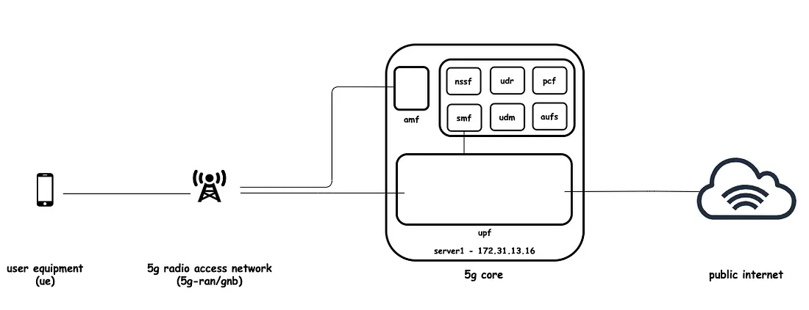
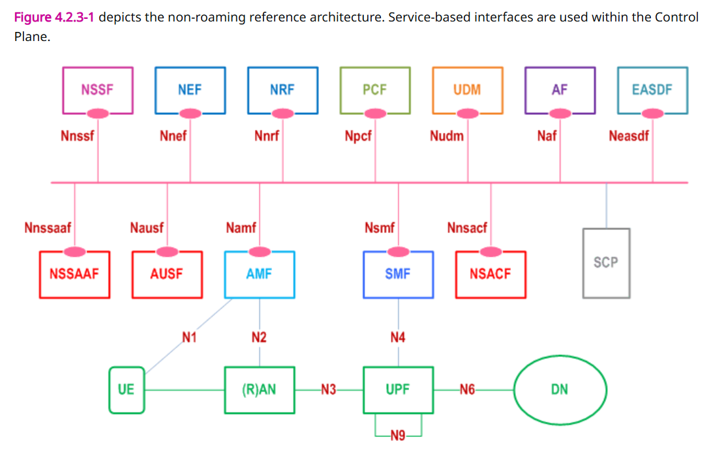
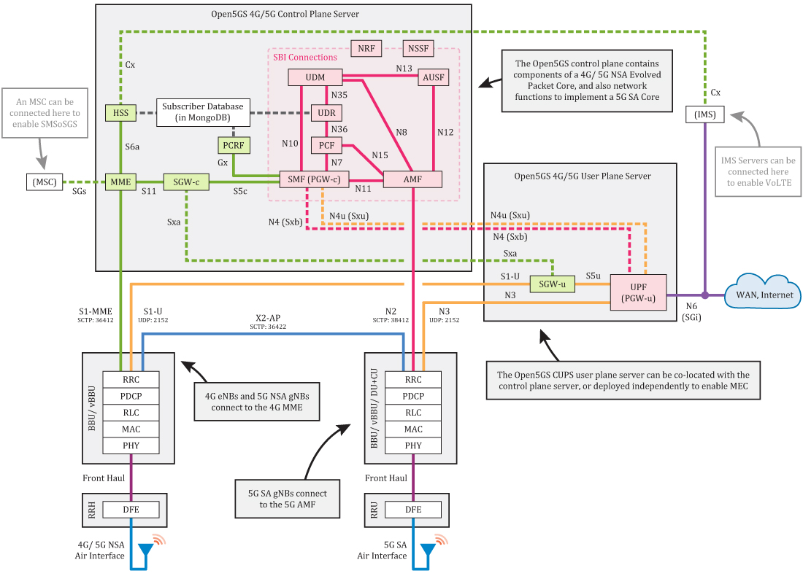

# Architecture of 5G Network

Before getting started, we’ll spend a moment to learn some basic concepts around 5G and understand the basic architecture of the software.

> This note is inspired by ["intro to free5gc src code"](https://www.cnblogs.com/zrq96/p/18400658).

## TL;DR

A deployed 5G network can be succinctly represented by the following diagram, which illustrates the core components and their interactions within the architecture:

In this diagram, **user equipment (UE)** connects to the **core network (5G Core)** via the **Radio Access Network (RAN)**. The core network processes requests from devices in a unified manner before routing them to the internet.

## Virtualization and SBA

> 5G core network can be seen as a containerized and microservices-based application

The 5G network architecture incorporates several novel technological approaches, with *virtualization* and *service-based architecture (SBA)* being the most prominent.  

(1) **Virtualization** refers to the implementation of as many **network functions (NFs)** as possible through software rather than dedicated hardware. This approach enables deployment using a limited variety of general-purpose computing resources rather than a diverse range of specialized equipment. The primary advantages of virtualization include enhanced flexibility, ease of deployment, and improved efficiency in production and procurement.  

The 5G network architecture standard, **TS 23.501**, defines key network functions such as the **AMF (Access and Mobility Management Function), SMF (Session Management Function), and NRF (Network Repository Function)**, which constitute (构成) the fundamental components of the 5G core network.  

(2) **Service-based architecture (SBA)** entails implementing network functions as microservices that interact with one another to facilitate the entire 5G network operation. The processes governing these interactions are specified in the **5G network procedures standard, TS 23.502**.  

In summary, from a software systems perspective, the **5G core network can be conceptualized as a containerized microservices-based application.**

The image above is a typical **non-roaming NFs architecture**.

Core Concepts:

|缩写|全称|中文|
|:---:|:---:|:---:|
|UE|User Equipment|用户设备|
|RAN|Random Access Network|接入网络|
|DN|Data Network|数据网络|
|NF|Network Function|网络功能服务|

⚠️ PDU (Protocol Data Unit): 指的是协议数据单元。在PDU会话（PDU Session）上下文中，它代表用户设备（UE）与数据网络（DN，Data Network）之间建立的数据传输通道

------

|缩写|全称|中文|注意|
|:---:|:---:|:---:|:---:|
|AMF|Access and mobility Management Function|接入与移动性管理|gNBs (5G basestations) connect to AMF `control.plane`|
|SMF|Session Management Function|会话管理||
|UPF|User Plane Function|用户数据平面|gNBs connect to UPF `data.plane` && UPF carries user data packets between the gNB and the external WAN. It connects back to the SMF as well|
|PCF|Policy Control Function|政策管控||
|AUSF|Authentication Server Function|服务器认证||
|NRF|NF Repo Function|网络功能存储库||
|NSSF|Network Slice Selection Function|网络切片选择服务||
|UDM|Unified Data Management|统一数据管理||
|UDR|Unified Data Repo|统一数据存储库||

## Open5GS Hierarchy

### 4G / 5G NSA Core

> corresponding to "the green line and components" in the picture above

|简写|全称|注意|
|:---:|:---:|:---:|
|MME|Mobility Management Entity||
|HSS|Home Subscriber Server||
|PCRF|Policy and Charging Rules Function||
|SGWc|Serving Gateway Control Plane|`ctrl.plane`|
|SGWu|Serving Gateway User Plane|`data.plane`|
|PGWc|Package Gateway Control Plane|aka. SMF `ctrl.plane`|
|PGWu|Package Gateway User Plane|aka. UPF `data.plane`|

⚠️ CUPS: (Control / User Plane Separation)

### 5G SA Core

> corresponding to "the red line and components" in the picture above

Besides what we mentioned in previous "Virtualization and SBA" part:

|简写|全称|中文|注意|
|:---:|:---:|:---:|:---:|
|SCP|Service Communication Proxy|服务交流协议|enable indirect communication|
|SEPP|Security Edge Protection Proxy|安全保障协议|ensure "roaming security"|

