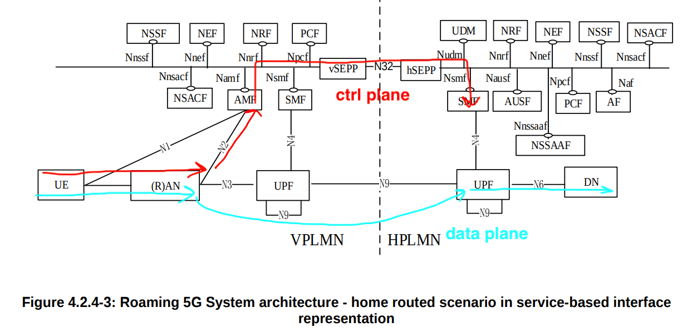
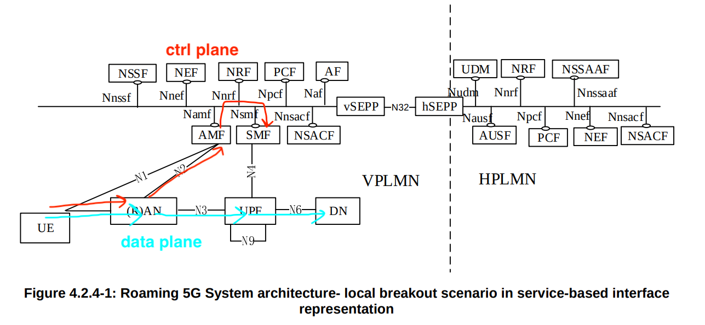

# Introduction of 5G Roaming

> This note is inspired by ["intro to 5G roaming" @free5gc](https://free5gc.org/blog/20250319/20250319/).

Roaming ensures subscribers can seamlessly access calls, messaging, and mobile data across different networks or countries.

It allows a **User Equipment (UE)** to access services while outside its **Home Public Land Mobile Network (HPLMN)** by connecting to a **Visited PLMN (VPLMN)**.

## Roaming Procedure

Take Open5GS hierarchy as an example:


### 1. UE Registration in the Visited PLMN (VPLMN)

> register

When the UE powers on in a roaming area, it **scans for available PLMNs** and selects the VPLMN based on roaming agreements. 

Then, the UE sends a **registration request to the V-AMF** (Access and Mobility Function in VPLMN), which checks the PLMN ID and detects that the UE is roaming.

```
UE -> scan for VPLMN -> regist request to V-AMF
```

### 2. Authentication and Security Procedures

> authentication

Since the UE is unfamiliar with the VPLMN, authentication must happen through the HPLMN. 

**V-AMF contacts the AUSF** (Authentication Server Function) in the HPLMN through SEPP (Security Edge Protection Proxy), which ensures secure inter-PLMN signaling. 

The **AUSF verifies** the UE's credentials, and if successful, **V-AMF will proceed** with security procedures.

```
V-AMF -> AUSF in HPLMN (via SEPP) -> AUSF verified -> V-AMF go on
```

### 3. SMF Selection

> PDU (Protocol Data Unit) session

Once authentication is complete, the UE needs **a PDU session to access the data**. 

The UE sends a PDU session establishment request to V-AMF, and it selects available SMFs based on the requested DNN and routing approach.

In 5G roaming, there are two ways of routing user data: Home-Routed (HR) and Local Breakout (LBO). They determine how a UE's traffic is forwarded when it connects to a visited network (VPLMN).

```
UE -> PDU session -> V-AMF -> select SMF (ctrl plane)
```

**Home-Routed Roaming (HR)**

Home-Routed Roaming returns all user data traffic to HPLMN before reaching the internet or other services. This means that:



1. **An H-SMF is selected** in step 3, and a PDU session is established with H-UPF. **Both SMF and UPF (User Plane Function) remain in the HPLMN**.
2. The VPLMN only provides radio access and mobility management (AMF).

In this case, data follows a longer path, which increases latency and allows the HPLMN to retain full control over security, billing, and policies. Enterprise users who need secure connections and sensitive data applications that require strict compliance are preferred to use this kind of routing method.

```
# for HR:
UE -> PDU session -> V-AMF -> H-SMF (ctrl plane)
UE -> PDU session -> H-UPF (data plane)
```

**Local Breakout (LBO)**

In Local Breakout (LBO), the user’s data traffic is directly routed through the VPLMN instead of being sent back to the HPLMN. Then:



1. **Step 3 selects a V-SMF**, and the PDU session is established with V-UPF. **Both SMF and UPF are located in the VPLMN**.
2. The VPLMN handles both control and user plane traffic.

In an LBO scenario, VPLMN is responsible for selecting the SMF, which means user data does not traverse back to the home network. Instead, it is **locally routed via the VPLMN’s User Plane Function (UPF)** to external networks.

Under this condition, data follows a shorter path, reducing latency and improving performance, which is suitable for latency-sensitive applications (e.g., gaming, video calls, streaming) or mobile operators since it can reduce operational costs.

```
# for LBO:
UE -> PDU session -> V-AMF -> V-SMF (ctrl plane)
UE -> PDU session -> V-UPF (data plane)
```

**Diff: HR and LBO**

|Feature|Home-Routed|Local Breakout|
|:---:|:---:|:---:|
|Data Routing|HPLMN UPF|VPLMN UPF|
|SMF/UPF Location|HPLMN|VPLMN|
|Latency|High|Low|
|Security|More Secure|Less Secure|

### 4. PDU Session Establishment

see [original file](https://free5gc.org/blog/20250319/20250319/#4-pdu-session-establishment) for details

## Conclusion

As 5G networks continue to expand, roaming plays a crucial role in enabling seamless connectivity for users traveling outside their home networks. In this article, two primary roaming approaches Home-Routed (HR) and Local Breakout (LBO) are introduced, offering different trade-offs in terms of latency, security, and operational costs.

Currently we are working on this part.
