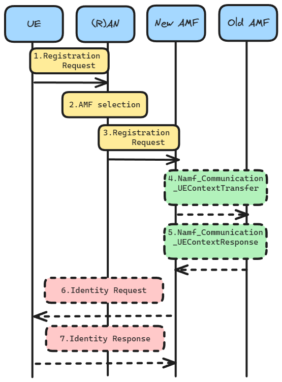

# Mobility Management: Registration Procedures

> This note is inspired by ["Registration procedures" @free5gc](https://free5gc.org/blog/20240119/20240119/).

## Introduction

> We are only care about Initial Reg and Mobility Reg in this project.

The purpose of registration procedures is to allow UEs to register for specific service access rights in 5G. They can be divided into four main type:

1. **Initial Registration** is a mandatory procedure that UEs must execute when they are first powered on. After completing this procedure, the core network will allocate the corresponding resources to the UE. If the UE is in the Idle state (CM-Idle) for a long period of time, causing the core network to lose the UE Context, the UE must also initiate this procedure.

2. **Mobility Registration** is a procedure that *UEs must initiate when they move to a new Tracking Area (TA)* that is not included in the UE's TAI List. This procedure is used to update the TA information.

3. **Periodic Registration** is similar to the Periodic TAU in 4G.

4. **Emergency Registration** is a procedure that UEs can use to register for emergency services, even if they do not have a valid 5G subscription.

## Registration Procedure with New AMF



**TL;DR** (`path_flow`): 

```
UE -> RAN -> New AMF
```

Detailed info can be checked [here](https://free5gc.org/blog/20240119/20240119/#description). We just omit these steps since space limitation.

## More about Mobility Management

Pls check my [google drive (mobile computing)](https://drive.google.com/drive/folders/12y-Tsbm1EmdYGBZ21iw1N8giT1QZ0hHg?usp=sharing) for details.

