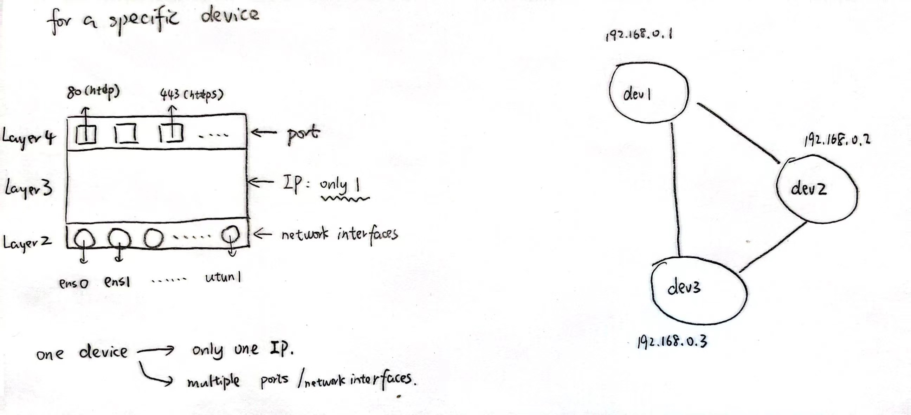
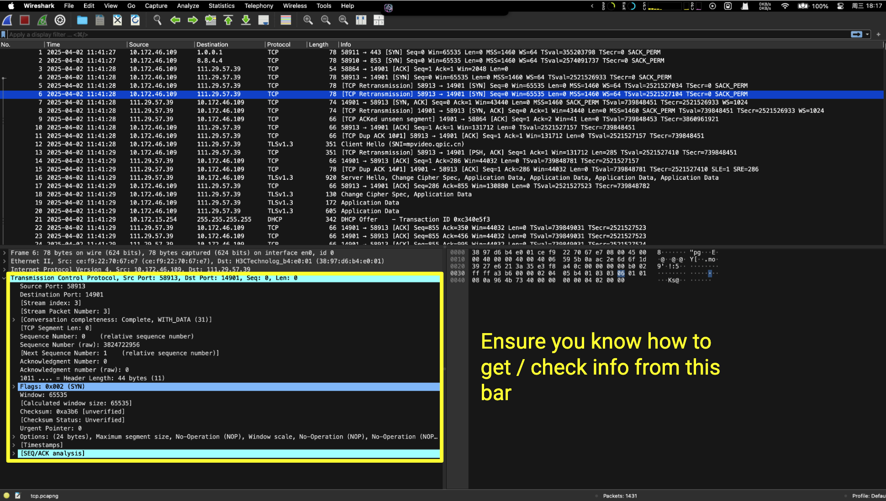
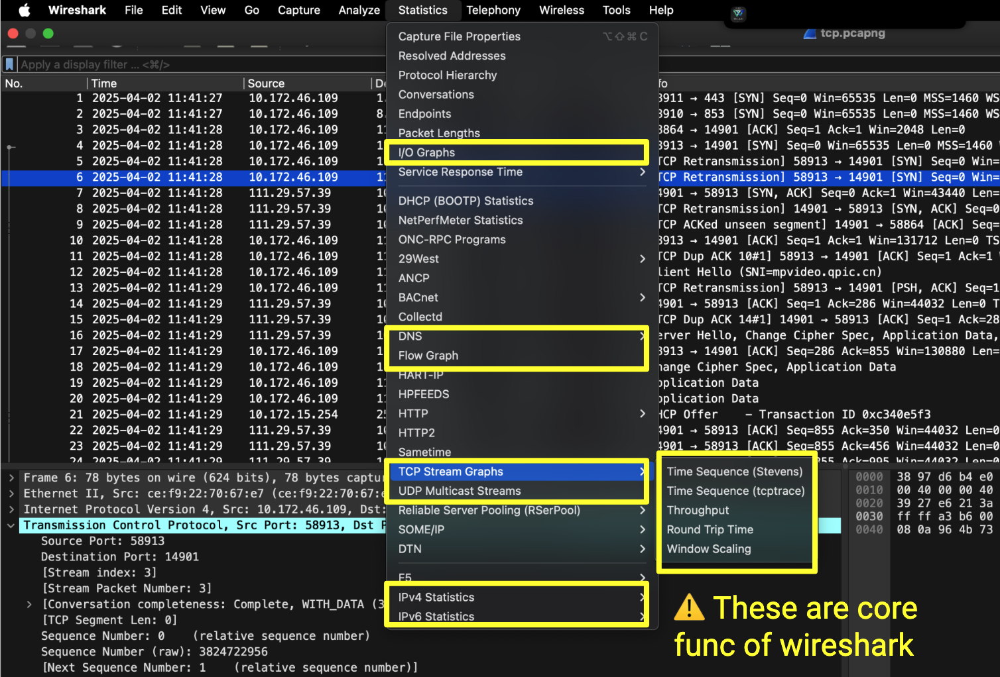
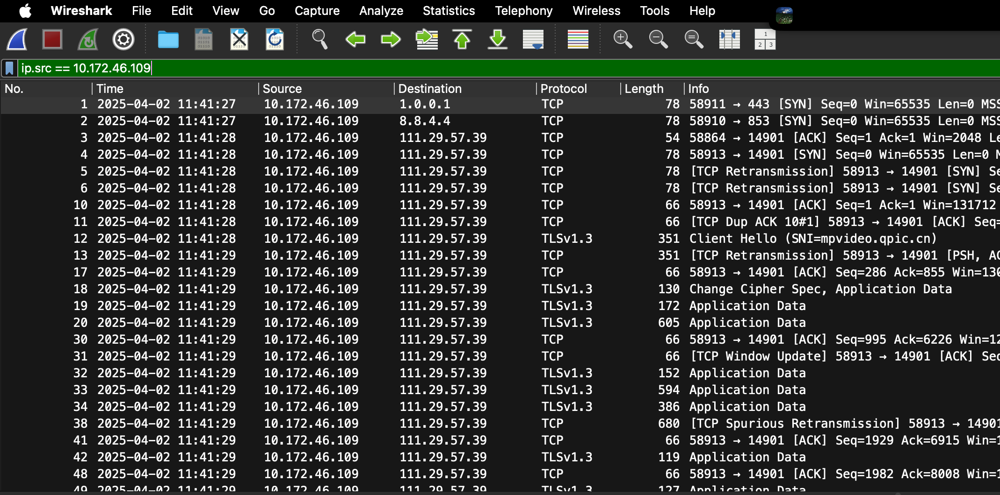
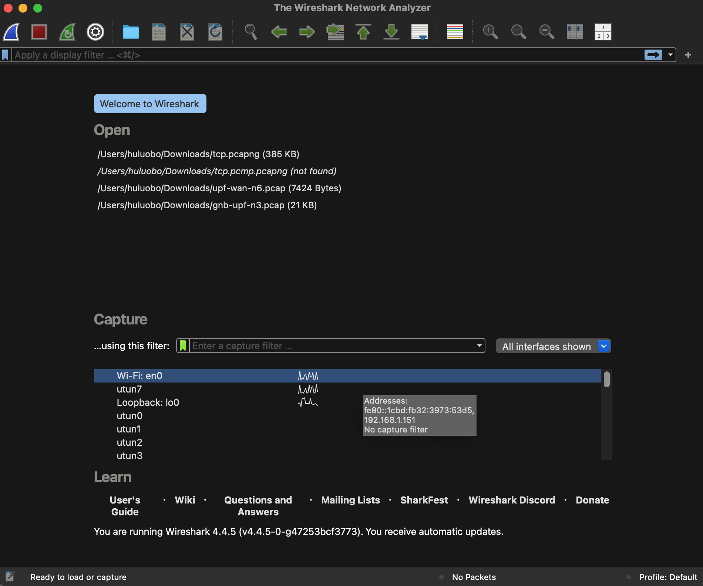
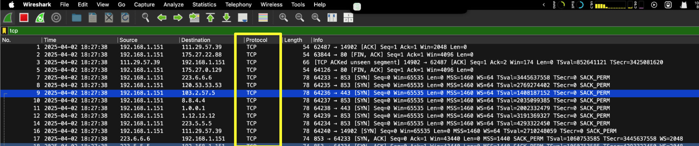

# Basic Tools for OpenSat

Here, we summarize and categorize some commonly used dev-tools and provide examples of their usage in different scenarios.

- `tcpdump`
- `Wireshark`

This note is inspired by [#issue 4](https://github.com/root-hbx/open5gs-satellite/issues/4).

## tcpdump

`tcpdump` is a powerful command-line packet analyzer. It allows you to capture and inspect network traffic in real-time. This tool is invaluable for network administrators, security professionals, and anyone who needs to understand network behavior.

Here we just showcase some commonly-used commands with this scenario as example:



Consider there are three virtual machine on my ubuntu physical device. (`192.168.0.[1/2/3]`)

We can open a terminal window on one of these VM devices, even on physical machine. And use `tcpdump` for data analysis and packet tracing.

Assume this window is working on `192.168.0.1` VM.

### Specify a network interface

```sh
tcpdump -i [INTERFACE_NAME]
```

**Catch: Any packet on this VM traveling via `INTERFACE_NAME`**

Since we are on `192.168.0.1`, this cmd will catch packets satisfying this:

- IP: `192.168.0.1` in and out
- NetInterface: `[INTERFACE_NAME]`
- Port: all ports

⚠️ `-i any`: catch *all network interfaces* on corresponding machine

### Specify a network host

```sh
tcpdump host [HOST_IP]
```

**Catch: Any packet on this VM traveling to or from `HOST_IP`**

(1) `tcpdump host 192.168.0.1`

Since "I" am on this machine:

- IP: `192.168.0.1` in and out
- NetInterface: default interface
    - `-i any`: all interfaces on this VM
- Port: all ports

(2) `tcpdump host 192.168.0.2`

Since "I" am not on this machine:

- IP: `192.168.0.1 <-> 192.168.0.2`
- NetInterface: `192.168.0.1`'s Interface connecting with `192.168.0.2`
- Port: all ports

### Specify a port

```sh
tcpdump port [PORT_NUM]
```

**Catch: All packets on this VM traveling on `PORT_NUM`**

Since we are on `192.168.0.1`, this cmd will catch packets satisfying this:

- IP: `192.168.0.1` in and out
- NetInterface: default interface
- Port: `[PORT_NUM]`

### Filter by Proc

```sh
tcpdump tcp
tcpdump udp
tcpdump icmp
```

- IP: `192.168.0.1` in and out
- NetInterface: default interface
- Port: all ports
- Protocol: `tcp/udp/icmp/...`

### Filter by (sub)network

```sh
tcpdump net 192.168.0.0/16
```

Since "I" am on `192.168.0.1`:

- IP: `192.168.0.1` in and out (`0.1 <-> 0.2` and `0.1 <-> 0.3`)
- NetInterface: default interface
- Port: all ports

### Specify for src/dst

```sh
tcpdump src host [HOST_IP]
```

IP: `HOST_IP` -> `192.168.0.1`

```sh
tcpdump dst host [HOST_IP]
```

IP: `192.168.0.1` -> `HOST_IP`

```sh
tcpdump src port [PORT_NUM]
```

- IP: `192.168.0.1` in and out
- NetInterface: default
- Port:
    - `192.168.0.1:PORT_NUM` -> XXX
    - `XXX:PORT_NUM` -> `192.168.0.1`

```sh
tcpdump dst port [PORT_NUM]
```

- IP: `192.168.0.1` in and out
- NetInterface: default
- Port:
    - `192.168.0.1` -> `XXX:PORT_NUM`
    - `XXX` -> `192.168.0.1:PORT_NUM`

### Save data as .pcap file

```sh
# save the data into ./[NAME].pcap file
tcpdump -w [NAME].pcap
```

### Some Instances

To be frank, the explanation of `tcpdump` above is overwhelmingly detailed, which may cause confusion in practical usage. 

For example: Which interface should I track? What is the default interface? etc.  

Therefore, we gonna summarize some commonly-used commands here.

Details can be checked [here](https://danielmiessler.com/blog/tcpdump).

1. Capture all traffic on interface `eth0/wlan0`:
    ```sh
    tcpdump -i eth0/wlan0
    ```
2. Capture traffic to or from host `example.com`:
    ```sh
    tcpdump host example.com
    ```
3. Capture traffic on port `NUM`:
    ```sh
    tcpdump port NUM
    # 80: HTTP
    # 443: HTTPS
    # 22: SSH
    # 53: DNS
    ```
4. Capture traffic from host `192.168.1.100` on port 443:
    ```sh
    tcpdump src host 192.168.1.110  and src port 443
    ```
5. Capture traffic to host `192.168.1.100` on port 80:
    ```sh
    tcpdump dst host 192.168.1.110 and dst port 80
    ```
6. Capture traffic to or from host `192.168.1.100` on port 80 or 443:
    ```sh
    # (1)
    tcpdump host 192.168.1.100 and \( port 80 or port 443 \)
    # (2)
    tcpdump "host 192.168.1.110 and (port 80 or port 443)"
    ```
7. Capture all traffic except ICMP:
    ```sh
    tcpdump not icmp
    ```
8. Capture all traffic except port 80:
    ```sh
    tcpdump not port 80
    ```

**TL;DR**

This is my favourite:

(1) tcpdump

```sh
sudo tcpdump -i any -w [xxx].pcap
```

Capture all packets traveling to or from my device and will be stored as `./[xxx].pcap`.

(2) scp on local machine

```sh
# open a new terminal window
scp xxx@xxx:remote_vm_path/[xxx].pcap  local_path/
# eg. scp open5gs@172.16.122.135:~/162.1.pcap ~/Downloads/
```

(3) wireshark on local machine

Will be introduced below ;)

## wireshark

Given that Wireshark is highly powerful and documentation is already available online, we will not elaborate further here. Instead, we provide relevant references for further reading.

- [learn wireshark](https://www.freecodecamp.org/news/learn-wireshark-computer-networking/)
    - [wireshark tcp graphs](https://www.packetsafari.com/blog/2021/10/31/wireshark-tcp-graphs/) 👍👍👍
    - [wireshark i/o graphs](https://stackoverflow.com/questions/33632393/io-graph-of-wireshark)
- [wireshark zhihu](https://zhuanlan.zhihu.com/p/506417526) 👍👍👍


As far as I am concerned, there some basic but powerful skills for you to start:

(1) Packet Checking



(2) Core Funcs for Packet Tracing



(3) Filter after catching



(4) Filter when catching






